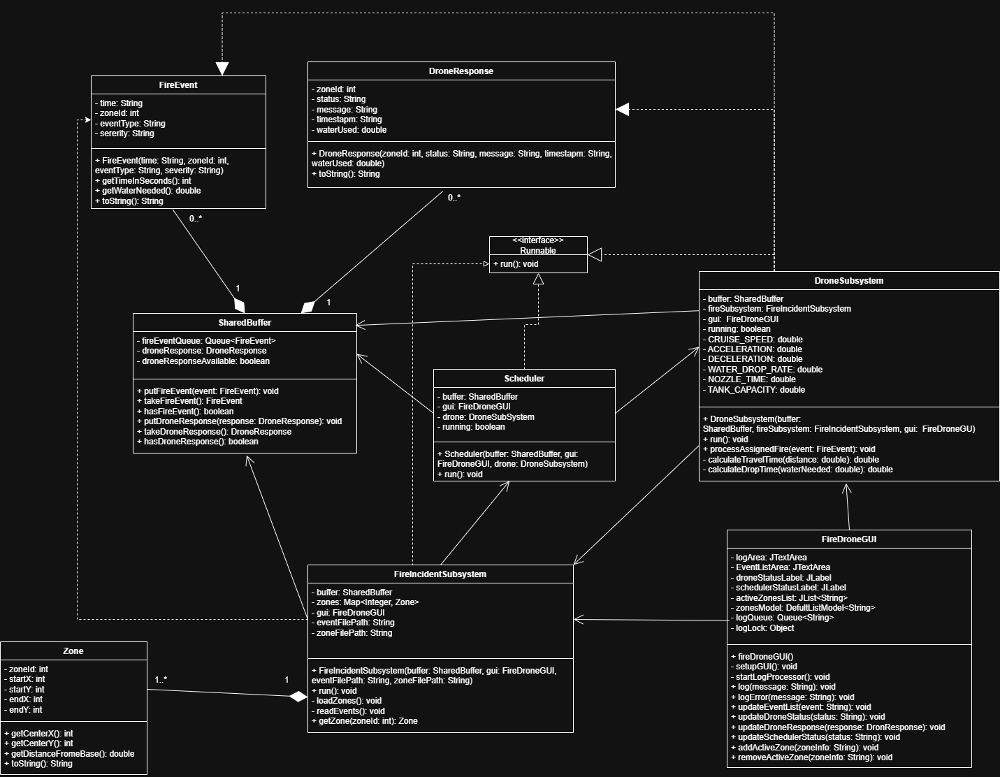
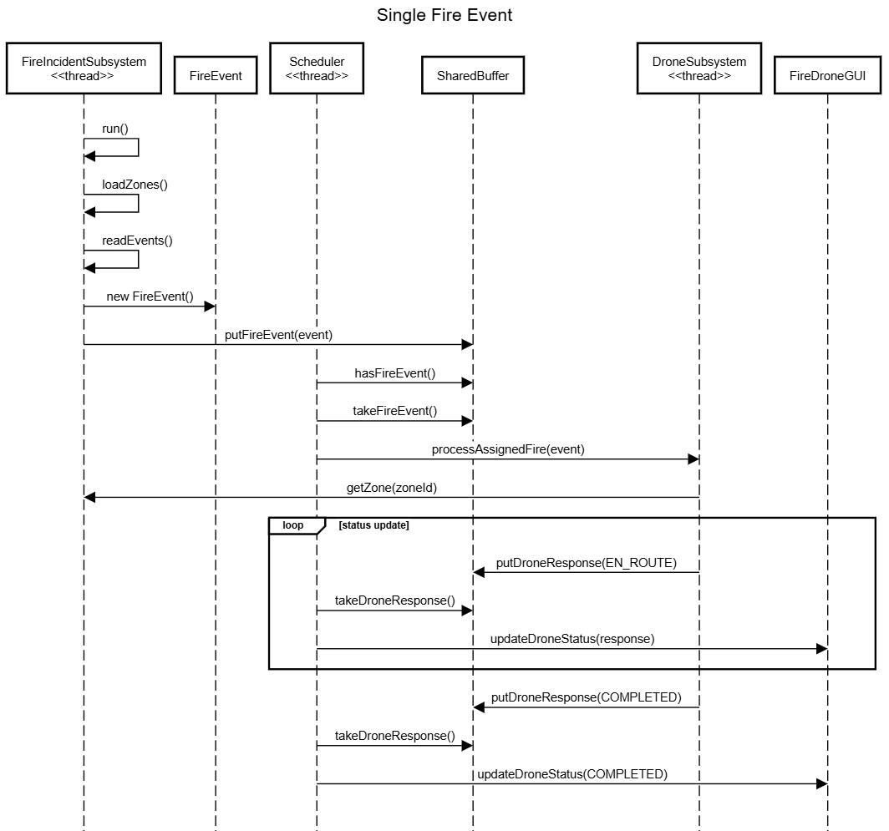
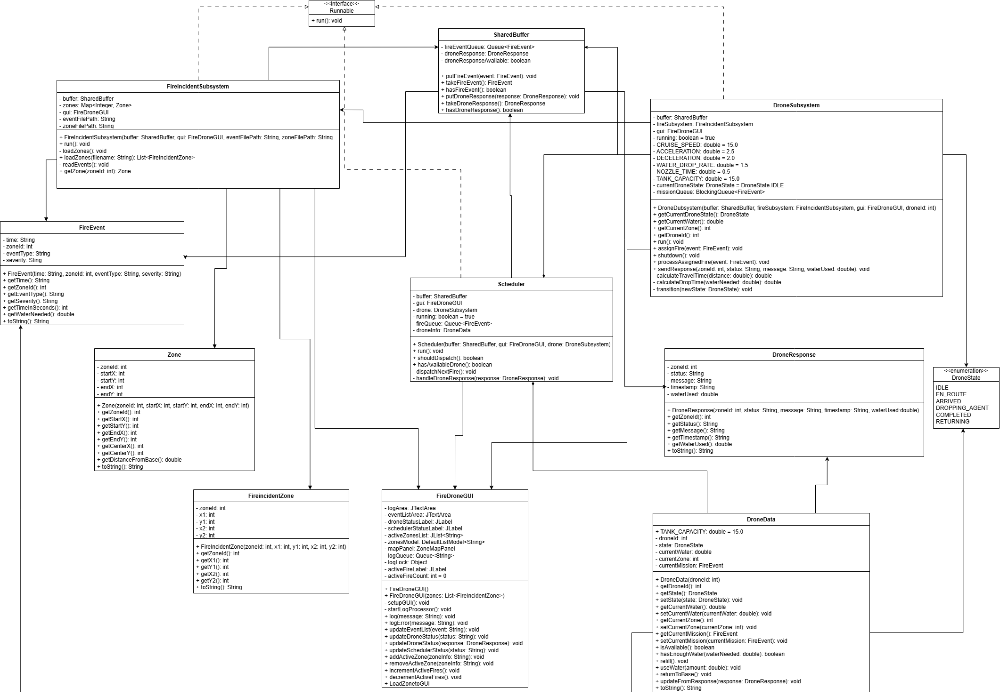
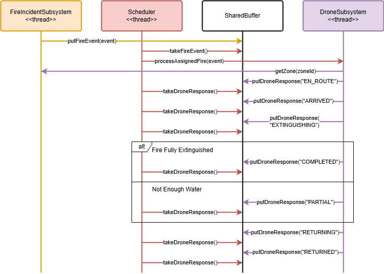
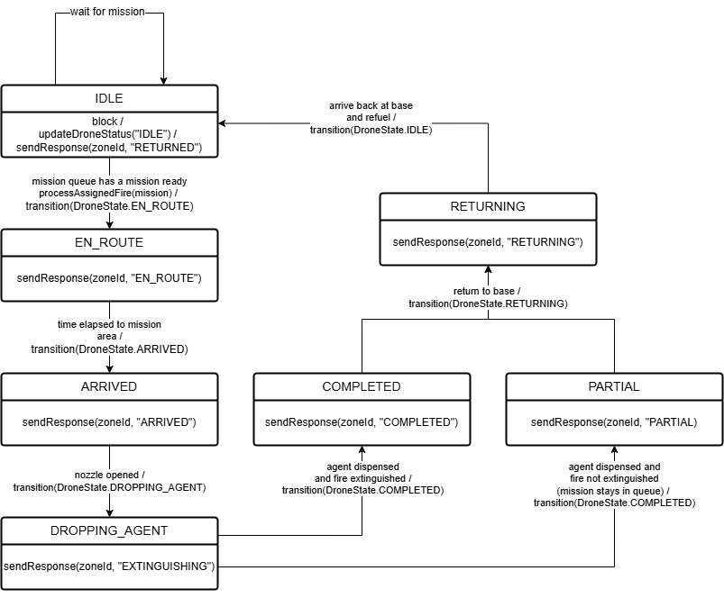
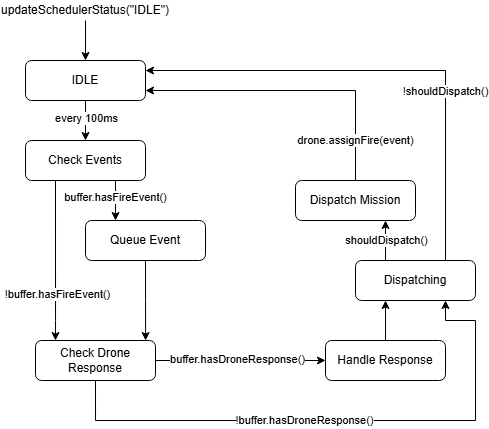
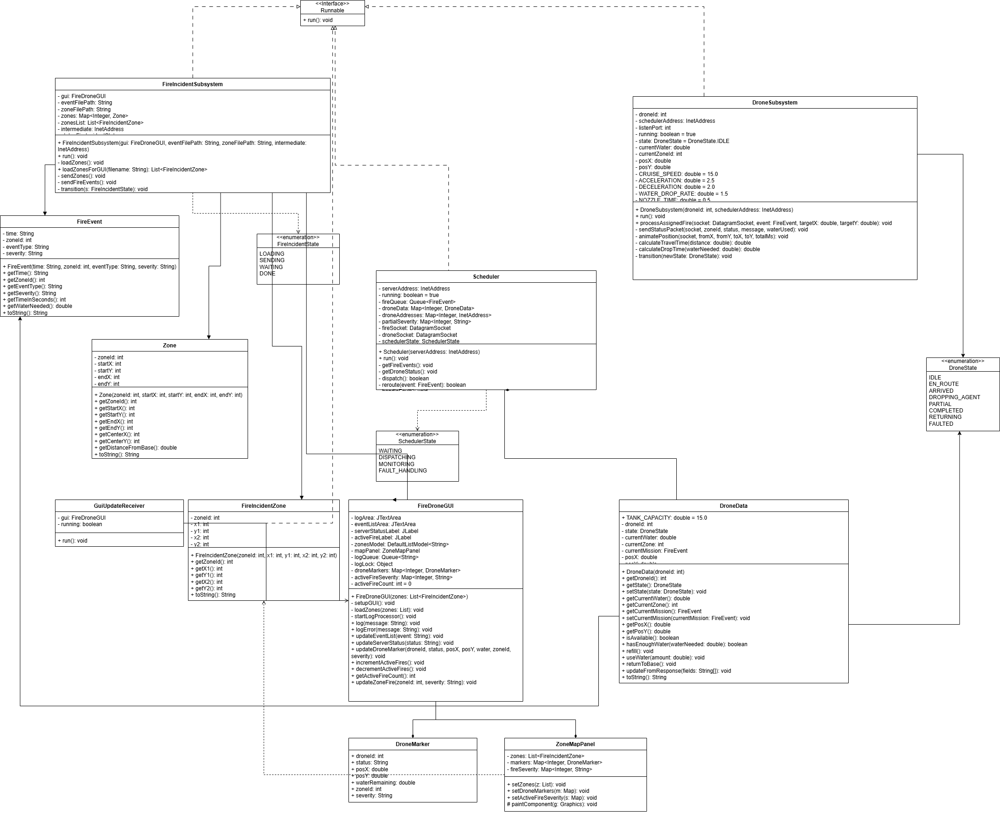
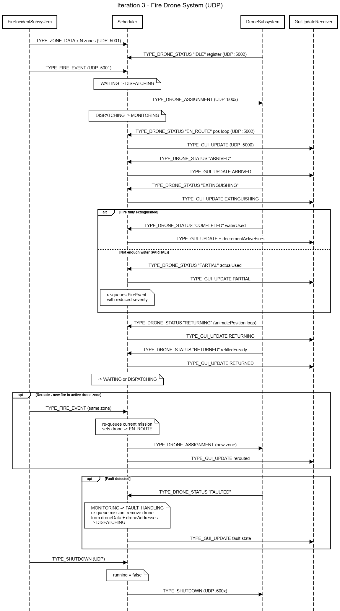
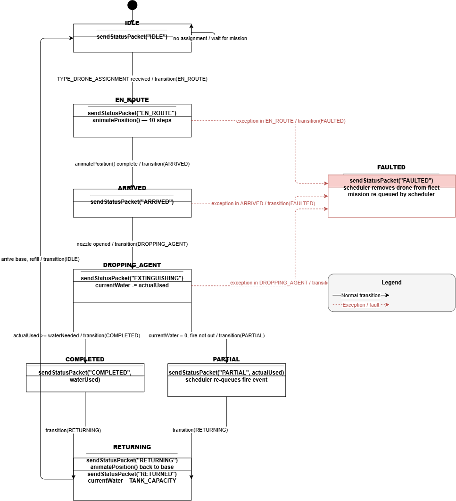
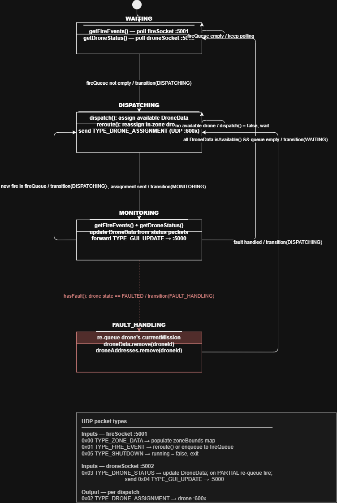

# Firefighting Drone Swarm - Iteration 1

**Group 12:** Jiayi Han, Declan Koster, Shael Kotecha, Edward Kurita

---

## Overview

This is the starting point for the Firefighting Drone Swarm system. This first iteration contains the most simplistic version
of this system. events and zones are read in from their respective csv files and a singular drone gets assigned by the 
scheduler to respond to the events in their respective zones.

The system contains the skeleton to support multiple drones and simulates the entire lifecycle of a single drone.

---

## File Structure

```
root/
│
├── Main.java
├── FireIncidentSubsystem.java
├── DroneSubsystem.java
├── Scheduler.java
├── SharedBuffer.java
├── FireDroneGUI.java
├── FireEvent.java
├── DroneResponse.java
├── Zone.java
│
└── data/
    ├── events.csv
    └── zones.csv
```

#### Main.java
- System entry point
- Initializes all threads
- Manages thread lifecycle
- Manages system timing and clean exit

#### FireIncidentSubsystem.java
- Loads zone coordinate data from CSV
- Reads fire events and adds them to the shared buffer from csv
- Runs as the producer thread

#### DroneSubsystem.java
- Simulates drone missions with math/data from iteration 0
- Simulates assigned fires through travel → fight → return cycle
- Runs as the consumer thread

#### Scheduler.java
- Coordinates between fire events and drone operations
- Reads events from buffer and assigns to drone
- Processes drone responses and updates GUI
- Runs as a coordinator thread

#### SharedBuffer.java
- Uses synchronized methods and wait/notify pattern
- Manages queues for fire events and drone responses

#### FireDroneGUI.java
- Swing-based graphical interface
- Displays logging for the drone, scheduler
- Shows active zones and system event log


Note: the gui currently does not have the actual map of drone progress, however the container for this map
exists and will be populated in future iterations.

#### Data Models
- **FireEvent.java**: Represents fire incidents with time, zone, severity
- **DroneResponse.java**: Contains each drones status updates and mission progress
- **Zone.java**: Geographic zone with coordinates and distance calculations

---

## Setup and Run

1) Clone the Repository
2) Open in IntelliJ

3) Run the project from main within IntelliJ

---

## UML Diagrams

### Class Diagram


### Sequence Diagram


## Iteration 2

**Group 12:** Jiayi Han, Declan Koster, Shael Kotecha, Edward Kurita

**Team Responsibilities:**
- **Shael Kotecha:** Documentation and implementation
- **Declan Koster:** Implementation — DroneData, DroneState, DroneSubsystem, Scheduler, GUI, Main updates
- **Jiayi Han:** Testing — JUnit 5 tests for all classes and integration tests
- **Edward Kurita:** UML sequence and class diagrams

---

### Overview

Iteration 2 adds state machines for the Scheduler and Drone subsystems. The system operates with a single drone to simplify debugging, while being designed with future multi-drone coordination in mind. The drone notifies the scheduler upon arriving at a zone and upon mission completion, at which point the scheduler checks for queued events before the drone returns to base.

---

### What's New in Iteration 2

- Core scheduling logic to decide which drone handles a new fire
- Drone state transitions: `IDLE → EN_ROUTE → DROPPING_AGENT → RETURNING`
- Drone communicates status updates back to the scheduler throughout its mission
- Once a mission is complete, drone checks for queued events before returning to base
- On return to base, drone is assumed to be fully recharged and refilled
- Each zone has at most one fire at a time
- GUI updated to track drone states and number of active fires

---

### File Structure
```
root/
│
├── Main.java                          ← UPDATED
├── FireIncidentSubsystem.java
├── FireIncidentZone.java
├── DroneSubsystem.java                ← UPDATED
├── DroneData.java                     ← NEW
├── DroneState.java                    ← NEW
├── Scheduler.java                     ← UPDATED
├── SharedBuffer.java
├── FireDroneGUI.java                  ← UPDATED
├── FireEvent.java
├── DroneResponse.java
├── Zone.java
├── DroneDataTest.java                 ← NEW
├── DroneSubsystemTest.java            ← UPDATED
├── SchedulerTest.java                 ← NEW
├── Iteration2IntegrationTest.java     ← NEW
│
└── data/
    ├── events.csv
    └── zones.csv
```

#### DroneData.java ← NEW
- Holds all data for an individual drone
- Tracks agent level, battery, and current zone assignment

#### DroneState.java ← NEW
- Enum defining all drone state machine states
- States: `IDLE`, `EN_ROUTE`, `DROPPING_AGENT`, `RETURNING`

#### DroneSubsystem.java ← UPDATED
- Implements drone state machine
- Handles all state transitions internally
- Sends status updates back to the scheduler at each stage

#### Scheduler.java ← UPDATED
- Implements scheduler state machine
- Assigns incoming fire events to the drone
- Processes drone responses and queues new tasks

#### FireDroneGUI.java ← UPDATED
- Now tracks and displays drone state
- Displays number of active fires in real time

---

### Setup and Run

1) Clone the Repository
2) Open in IntelliJ
3) Run the project from Main within IntelliJ

---

### UML Diagrams

### Class Diagram


### Sequence Diagram


### State Machine Diagrams
#### Drone State Machine Diagram


#### Scheduler State Machine Diagram


### Iteration 3 UML
### Class Diagram


### Sequence Diagram


### State Machine Diagrams
#### Drone State Machine Diagram


#### Scheduler State Machine Diagram

